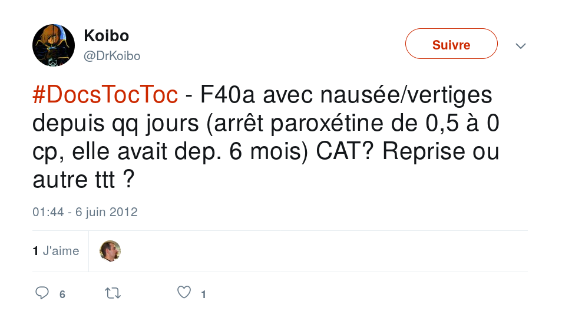

class: center, middle

# Atelier #DocTocToc

---

# Atelier \#DocTocToc

Les gentils organisateurs.

| @doc_martin_p    || @FlBontemps   || @MedecineLibre  || @nb54000   |
| :-------------:  ||:------------:|| :-------------:||:----------:|
| MG            || pharma        || dev & MG       ||chir ORL ||
| ![][doc_martin_p] || ![][FlBontemps] || ![][MedecineLibre] || ![][nb54000] |

### Références

[doc_martin_p]: doc_martin_p.jpeg "PP"
[FlBontemps]: FlBontemps.jpg "PP"
[MedecineLibre]: MedecineLibre.jpg "PP"
[nb54000]: nb54000.jpg "PP"

---

# Programme

1. 5 mn présentation
2. 10 mn Théorie
3. 5 mn Questions
4. 40 mn Pratique

Option: 30 mn (prolongations)

---

# Plan diaporama

1. Présentation
3. Twitter
4. \#Medtwitter
5. \#DocTocToc
6. Confidentialité, éthique, pseudonymat
7. MG
8. Spécialistes
9. Interpro (sage-femme, pharmacien, kiné, IDE...)
10. @DocTocTocBot
10. Cas cliniques

---

# Twitter - Intro

* 2006
* microblogging
* tweet: 140 caractères -> 280 caractères
* 313 millions d’utilisateurs actifs / mois
* 500 millions de tweets / jour
---

# Twitter - Hashtag

* \# = Hash
* mot-dièse
* [\#brexit](https://twitter.com/hashtag/brexit)
* [\#CJMG2019](https://twitter.com/hashtag/CJMG2019)
* [\#DocTocToc](https://twitter.com/hashtag/)

---

# Twitter - PP (Photo de Profil)
![alt text][katyperry] > ![alt text][docteurmathieu] > ![alt text][default]

### Texte
Choisir une image (avatar) ou une photo de vous pour votre profil permet aux utilisateurs de mieux mémoriser votre compte.
Vous augmentez vos chances d'avoir une réponse et de voir votre réseau grandir.
Vous pouvez rester sur l'icone par défaut mais ne facilitera pas la mémorisation et ce n'est pas très engageant. Via un pseudo ou via votre nom, la réputation fait beaucoup sur les réseaux sociaux.

### Références

[default]: default_profile.png "PP par défaut"
[katyperry]: katyperry.png "PP Katy Perry"
[docteurmathieu]: docteurmathieu.png "PP ᴅᴏᴄᴛᴇᴜʀᴍᴀᴛʜɪᴇᴜ"

---

#\#DocTocToc

2012

---

# Crowdsourcing

## EBM
### Etude
* Muse et al., “From Second to Hundredth Opinion in Medicine.”
Serious medical diagnostic errors lead to adverse patient outcomes and increased healthcare costs. The use of virtual online
consultation platforms may lead to better-informed physicians and reduce the incidence of diagnostic errors.

### Thèses
* Salles, “Analyse du Discours médical sur Twitter : étude d’un corpus de tweets émis par des médecins généralistes entre juin 2012 et mars 2017 et contenant le #DocTocToc.”